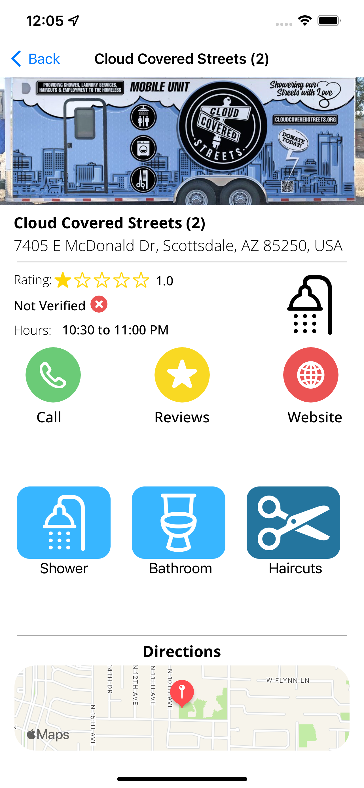
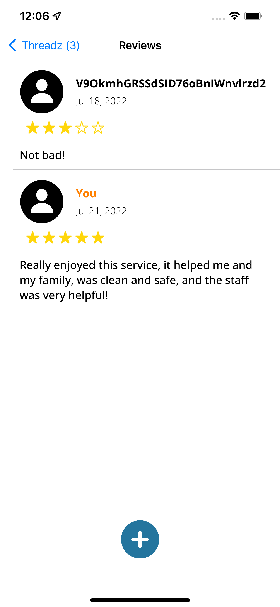
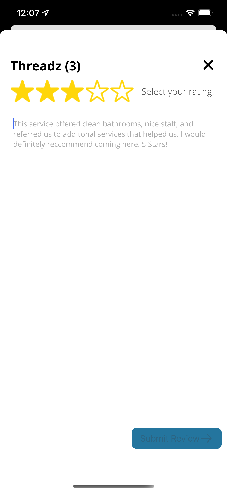
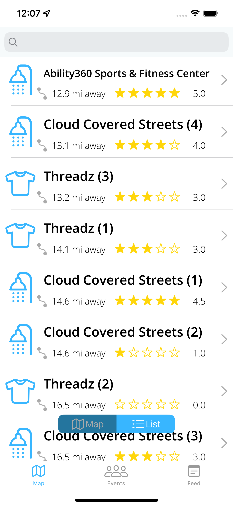

# Safe Hygiene 4U
## _Updates and Photos_

## 7/21/22 Update

- Added CoreDB Database to save data offline
- Connected firestore database to excel sheet to allow for easy data entry
- Finished the Review Details view
- Added Reviews
- Added service details and searchable list

## 7/1/22 Update

- Added side menu to give more options to the map
- Created log in and sign up pages
- Edited View that pops up after a pin is selected
- Added google sign in OAUTH functionality 
- Added about page and location suggestion forms

## 6/20/22 Update

- Added Custom Pins that change based on service type and rating
- Added View that pops up after a pin is selected
- Created objects to store services
- Set up Google Firebase Database and stored pins on that database
- Connected app to database so that pins are loaded from the DB and displayed on the map

