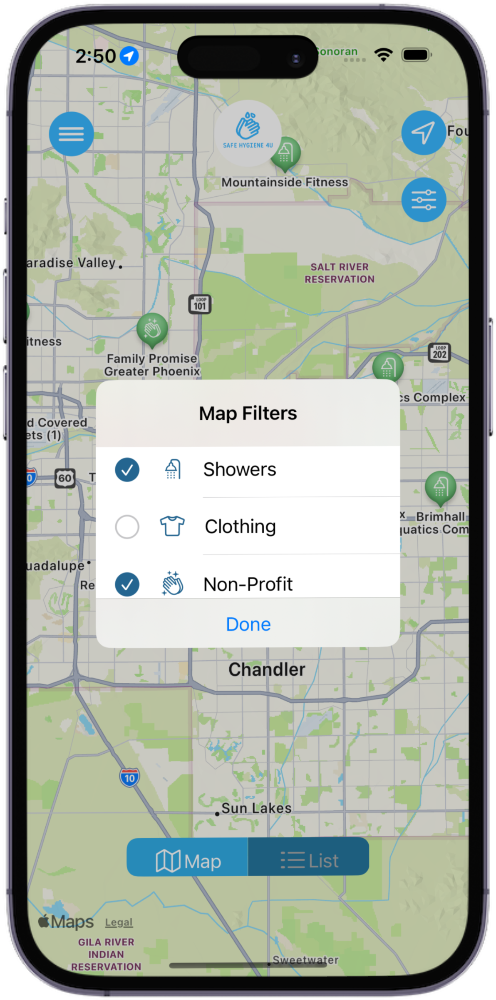
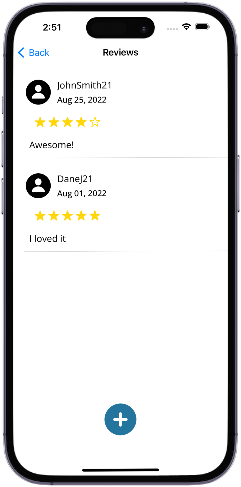

# Safe Hygiene 4U
## _iOS Application that helps homeless individuals find safe hygiene services in the Phoenix area_
### Safe Hygiene 4U app developed by ASU students as part of the Public Value Technology Accelerator with funding provided by Apple.

## Main Features
- Features map that lists services near your location, shows service type/rating
- Users can Tap on service to show details and filter the map/list to only show certain services
- Displays every service in a searchable list sorted by distance from the user
- Details on every service are displayed after being tapped including Info Address, Rating, Hours, Phone Number, Website, Available Resources, Directions, and any additional notes
- Users can login to save services for easy access later and to review other services 

## Screenshots

